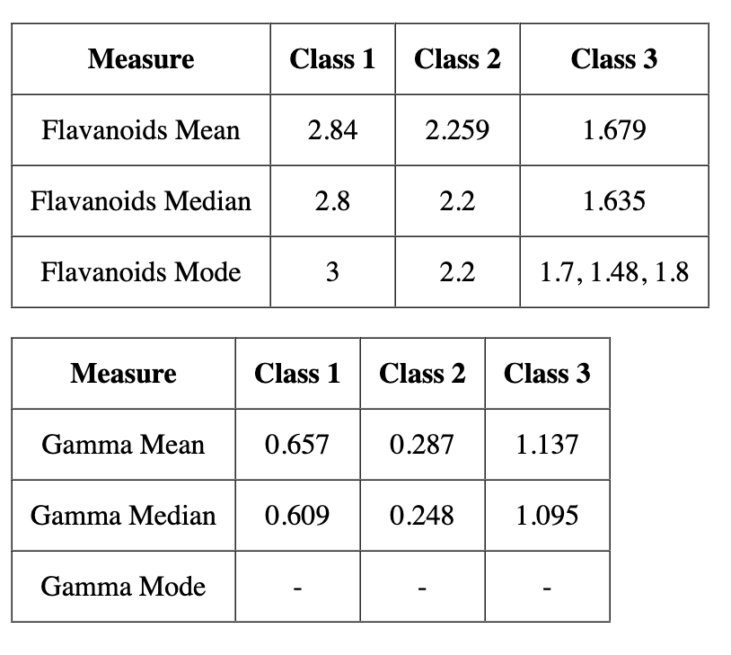

# Manufac SDE Interview Assignment - Data Visualization Task

## Description

This repository contains my solution to the Manufac SDE interview assignment on Data visualization. The assignment required me to complete a specific task or solve a problem. In this document, I will provide details about my solution and how to run it.

## Table Screenshots



## Explanation

While calculating the data few considerations were made which are as follows:

- Values are formatted based on its type. For example: **3 -> 3 instead of 3.000, 2.8 -> 2.8 instead of 2.800, 3.123456789 -> 3.123**
- For the Mode, as per the concept there can be either **no mode, 1 mode** or **more than one modes**. So, if there are more than one modes possible then they are represented as comma separated values. If, 1 mode is possible it is represented as it is. And, if all the values appeared the same number of times or there is no mode possible then it is representd with **"-"**.

## Prerequisites

- Node.js: Make sure you have Node.js installed on your machine.

## How to run

- Download the zip file or clone it using the below command

```
git clone https://github.com/frontend-with-sumit/manufac.git
```

- To install the required packages, use the below command in the terminal

```
yarn
```

- To start the server

```
yarn start
```
